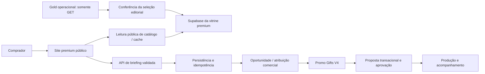

# Arquitetura proposta e contrato com o comercial

## Decisão

Manter **Promo_Gifts_V4** como aplicação operacional e fonte das regras comerciais. Usar uma aplicação pública **Next.js + React + TypeScript**, com conteúdo renderizado no servidor e componentes interativos onde necessários. A vitrine possui banco dedicado `whwloseshzraipljisqo`, com oito produtos curados e uma tabela privada de briefings ainda vazia.

O frontend atual renderiza a home no servidor, mas reúne boa parte da interação em `Storefront.tsx`. Na integração de produção, dividir ilhas por busca, seleção e personalização, medindo o impacto real no bundle. Não importar providers, BI, simuladores internos ou SDKs administrativos do backoffice para o site.



O trecho de passagem ao comercial no diagrama representa a **integração futura**. A fonte operacional é estritamente de leitura para este projeto: nenhum receptor de briefing pode apontar diretamente para esse Supabase, e não há credencial administrativa da origem no site. A sincronização explícita confere a seleção na view `v_products_public` com chave publishable antes de gravar somente no banco premium. A rota pública, a home, as fichas e a validação de briefing leem o banco dedicado da vitrine quando configurado; o snapshot editorial é só fallback offline. As imagens são locais. O briefing permanece em download no navegador enquanto a entrega estiver desligada. Ainda não há vínculo com CRM.

## Contratos de dados

| Superfície | Campos permitidos propostos                                                                                    | Dados que não devem chegar ao navegador                                           |
| ---------- | -------------------------------------------------------------------------------------------------------------- | --------------------------------------------------------------------------------- |
| Listagem   | ID, SKU público, slug, título editorial validado, categoria, imagem, mínimo e elegibilidade                    | Custo, margem, credenciais, organização, regras internas, payloads de fornecedor  |
| Detalhe    | Descrição revisada, especificações, inclusões, variantes publicáveis, imagens e condições                      | Dados pessoais de cadastro, caminhos internos de fornecedores e notas de operação |
| Preço      | Preço de venda contextualizado, quantidade, personalização incluída, validade, impostos/frete quando definidos | Custo base, markup, margem, comissão e descontos privados                         |
| Briefing   | Versão, ID idempotente, empresa/contato, ocasião, data desejada, itens e observações necessárias               | Credenciais de integração e lógica privada de atribuição                          |
| Protocolo  | Identificador público opaco, estado útil e próximos passos                                                     | ID sequencial acessível sem autorização, notas internas, outros clientes          |

DTO público é uma **allowlist**. `cost_price = null` na view é uma defesa existente, mas a aplicação deve omitir o campo de sua resposta. `supplier_id`, `ncm_code` e `bitrix_product_id` não precisam fazer parte da experiência pública inicial.

## Regras de leitura

1. Host do banco desta vitrine é `whwloseshzraipljisqo.supabase.co`; o host operacional de Promo_Gifts_V4 é `doufsxqlfjyuvxuezpln.supabase.co`. Validar cada hostname exato com `URL`.
2. A vitrine lê somente `premium_catalog_items` publicado. Reimportações futuras do Gold operacional exigem revisão de dados e direitos antes da publicação.
3. Filtrar produto publicável, ativo, íntegro e com dados aprovados. `active=true` sozinho não é sinônimo de aprovação editorial.
4. Paginar no servidor; ordenar com desempate por ID; limitar valores de página e busca.
5. Retornar ausência e falha como estados diferentes. Não converter timeout em “nenhum produto encontrado”.
6. Verificar preço e estoque com frescor adequado; cache de texto não precisa ter o mesmo TTL de disponibilidade.
7. Mídia precisa de fallback registrado, formatos responsivos e monitoramento de HTTP 403/404.

A relação `v_site_products_public` é mencionada na documentação interna, mas não teve sua definição administrativa revalidada nesta sessão. Ela é candidata a inspeção, não uma API presumida como pronta.

## Escrita e passagem para o CRM

Uma solicitação pública deve criar primeiro um **briefing/oportunidade** no contexto permitido. O navegador não cria uma proposta definitiva com preços ou desconto enviados pelo cliente.

Contrato de referência a implementar:

```json
{
  "version": "1",
  "request_id": "uuid-gerado-para-a-solicitacao",
  "contact": { "name": "", "company": "", "email": "" },
  "occasion": "onboarding",
  "requested_date": "2026-12-01",
  "budget_band": "100-250",
  "items": [
    { "product_id": "uuid-canonico", "variant_id": null, "quantity": 50 }
  ],
  "notes": "",
  "privacy_notice_version": "versao-aprovada"
}
```

Isso é uma proposta de contrato para passagem ao comercial. A tabela privada `premium_briefings` persiste o briefing apenas quando a entrega é ativada por variável explícita. A chave e o hash do conteúdo são únicos, e uma lease no banco impede duas chamadas concorrentes ao receptor. Arquivos devem ter upload validado e acesso privado; a referência ao arquivo fica no briefing, não um blob/base64 em eventos de analytics.

O servidor valida esquema e regras; resolve novamente produto e variante; aplica proteção contra abuso; persiste com idempotência; encaminha conforme regras aprovadas; confirma protocolo somente depois do commit. A ação de converter em proposta utiliza as funções transacionais e de aprovação existentes. Nomes concretos do destino de lead e do adaptador CRM dependem de inventário e revisão com a operação.

Resposta implementada: 201 para criado; 200 para replay entregue; 202 para outra chamada enquanto a mesma entrega está reservada; 409 para chave reutilizada com conteúdo diferente; 422 para validação; 429 para excesso e 503 para indisponibilidade recuperável. Nunca usar uma mensagem de sucesso gerada apenas por timer. Logs têm `request_id`, resultado, latência e IDs técnicos mínimos; não devem carregar e-mail, texto livre ou arquivos completos.

## Privacidade e persistência

Na prévia, `localStorage` contém apenas IDs de seleção, quantidades, favoritos e progresso opcional do plano. Campos de contato do formulário ficam na memória e no download solicitado. Com `BRIEFING_DELIVERY_ENABLED=false`, o navegador não envia esses campos a um endpoint. A política local descreve precisamente isso.

Na produção, jurídico/responsável deve validar controlador, finalidade, base legal, retenção, canal de direitos e operadores. A existência de formulário não implica automaticamente um checkbox de marketing obrigatório. O cadastro para comunicação promocional, quando houver, precisa ser separado do atendimento solicitado conforme análise aplicável.

## Ambientes e release

Preview fica `noindex` e sem promessa de recebimento comercial. Staging valida integração e dados de teste. Produção recebe domínio aprovado, segredos no servidor, monitoramento, política final e runbook de rollback. Não usar schema de produção como ambiente descartável.

O AGENTS de **Promo_Gifts_V4** protege o schema operacional `doufsxqlfjyuvxuezpln`; ele não foi alterado. A migration versionada e aplicada aqui pertence somente ao projeto dedicado da vitrine, informado pelo usuário. Seu resultado e as verificações de RLS estão em [SUPABASE_SITE_DATABASE.md](SUPABASE_SITE_DATABASE.md).

## Critérios de aceite de integração

- Catálogo público responde sem sessão e somente com campos permitidos.
- Custos, margem e dados pessoais não aparecem em HTML, JSON, logs públicos ou JS.
- Filtros e paginação têm resultado estável e contagem coerente.
- Produto despublicado sai do site no SLA definido.
- Solicitação duplicada tem um único destino comercial.
- Falha entre persistência e CRM é conciliável sem perder briefing.
- Comercial recebe ID, variante, quantidade, ocasião, observações e arquivo correto.
- Proposta formal preserva regras de aprovação e autorização.
- Sucesso exibido corresponde ao estado persistido no servidor.
- Logs e alertas permitem investigar erro por protocolo sem revelar conteúdo pessoal.
