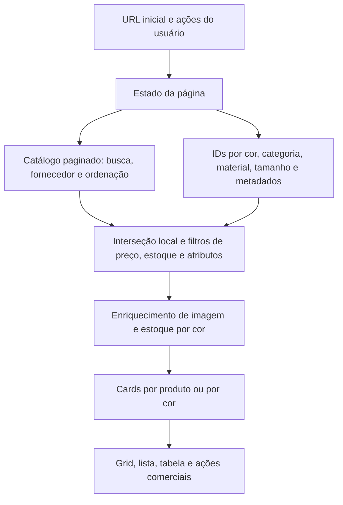
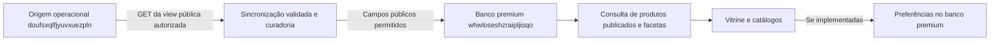

# Super Filtro → descoberta de produtos na vitrine premium

Auditoria de 22/09/2026. Referência solicitada: <https://www.promogifts.com.br/filtros>.

**Recomendação executada:** a primeira versão premium usa categoria, ocasião editorial, possibilidade de personalização e quantidade mínima. A incorporação de cores, materiais, técnicas, preços e disponibilidade continua condicionada a contratos de dados próprios e verificados.

O Super Filtro é uma ferramenta de trabalho para vendedores. A vitrine atende quem está escolhendo um presente corporativo. Essa diferença muda quais controles precisam aparecer, o significado das contagens e as informações comerciais que podem ser expostas.

A auditoria original contém **análise, evidências reproduzíveis e um backlog de 30 itens**. A implementação posterior incorporou os padrões seguros que os dados públicos atuais permitem e atualizou o plano de 200 etapas conforme as evidências. Dependências comerciais, conteúdo não licenciado e atributos ausentes não foram simulados como concluídos.

## Status da implementação posterior

| Frente             | Resultado implementado                                                                                                            | Evidência principal                                                   |
| ------------------ | --------------------------------------------------------------------------------------------------------------------------------- | --------------------------------------------------------------------- |
| Contrato           | Versão `2026-09-22.2`; OR entre ocasiões, AND entre dimensões; limites e inválidos explícitos                                     | `src/lib/catalog.ts`, `src/app/api/catalog/route.ts`                  |
| Descoberta         | Busca normalizada, aliases editoriais, sugestão explícita de um caractere, categoria, ocasião, personalização e quantidade mínima | `src/components/CatalogFilters.tsx`, `src/components/Storefront.tsx`  |
| Navegação          | URL completa, recarga, Voltar/Avançar, chips removíveis, limpeza geral e ordenação preservada                                     | `tests/storefront.spec.ts`                                            |
| Contagens          | Total e facetas contextuais sobre a mesma projeção completa, antes da paginação                                                   | `src/lib/site-database.ts`, `tests/public-api.spec.ts`                |
| Estados            | Carregamento ligado à requisição, descarte de resposta antiga, erro persistente, retry e correção de busca anunciada              | `src/components/Storefront.tsx`, `tests/storefront.spec.ts`           |
| Segurança de dados | Origem operacional permanece GET-only; navegador recebe apenas campos públicos e a página solicitada                              | `scripts/tests/catalog-boundary.test.mjs`, `src/lib/site-database.ts` |
| Privacidade        | Evento local registra dimensões, total, duração e sucesso, sem texto pesquisado ou dados de cliente                               | `src/components/Storefront.tsx`                                       |

Cores, materiais, técnicas, preço, estoque e prazo não aparecem como filtros porque não há cobertura pública homologada para sustentar essas promessas. O servidor lê a projeção premium em páginas cacheadas de 500, limita o conjunto auditado a 10.000 itens e envia ao navegador no máximo 24 por resposta. Antes de um catálogo de grande volume, o cálculo deve ser medido em cache frio e, se necessário, migrado para agregação no banco premium.

## 1. Escopo e grau de comprovação

| Frente                     | Evidência obtida                                                                                   | Limite                                                                                                   |
| -------------------------- | -------------------------------------------------------------------------------------------------- | -------------------------------------------------------------------------------------------------------- |
| Site publicado             | Chromium, desktop 1440 × 1000; `/filtros` redireciona para `/auth`                                 | Não houve acesso à interface autenticada; não atribuir a ela avaliações visuais ou de desempenho medidas |
| Código V4                  | Checkout `e3ed6c5dba080bc9601a42d99e2fc5e00e319ad6`, branch `codex/e15-pooler-validation-20260922` | Não foi comprovado que esse commit corresponde ao deploy do domínio                                      |
| Motor de filtros           | 124 testes existentes executados, todos aprovados, sem rede                                        | Cobrem o motor puro com dados sintéticos, não consultas reais ou jornada completa                        |
| Sincronização de materiais | 2 reproduções com o hook React real e dependências de dados simuladas                              | Confirmam perda de seleção nesse cenário isolado; falta validar a jornada no deploy                      |
| Casos adicionais           | 10 sondagens do pipeline original, com saída e hashes dos arquivos                                 | Alguns resultados comprovam riscos; “teste passou” não significa “comportamento desejável”               |
| Premium                    | Contrato, API, consulta, navegação e biblioteca examinados no commit `61dec84`                     | O snapshot versionado tem 8 produtos e 6 coleções; não foi refeita a contagem do banco nesta auditoria   |
| Bancos                     | Nenhuma consulta direta ou mutação realizada nesta auditoria                                       | Não houve auditoria de schema, grants, RLS ou conteúdo atual dos bancos                                  |

Na inspeção de navegador foram bloqueados métodos diferentes de GET/HEAD e caminhos de RPC. Duas tentativas de POST a `get-visitor-info` foram bloqueadas. Credenciais não foram utilizadas para contornar autenticação.

Evidências: [navegação anônima](audit/super-filtro-20260922/live-anonymous.json), [captura do login](audit/super-filtro-20260922/live-desktop.png), [execução](audit/super-filtro-20260922/execution.json), [124 testes](audit/super-filtro-20260922/simulation-results.json), [2 reproduções](audit/super-filtro-20260922/material-state-results.json), [10 sondagens](audit/super-filtro-20260922/probe-results.json) e [versões e hashes das referências](audit/super-filtro-20260922/source-manifest.json).

## 2. Como o módulo funciona no código examinado

O painel organiza as opções em quatro grupos: **Produto, Comercial, Marketing e Atalhos**. A página combina busca, ordenação, presets, histórico, layouts, seleção de produtos e ações comerciais. [Definições do painel][v4-types], [página][v4-page].

| Camada         | Comportamento encontrado                                                                                       | Consequência para a adaptação                                                                     |
| -------------- | -------------------------------------------------------------------------------------------------------------- | ------------------------------------------------------------------------------------------------- |
| Busca          | Campo textual, histórico, debounce de 400 ms no carregamento e reordenação local com Fuse                      | Unificar busca, relevância e conjunto consultado; evitar duas regras incompatíveis                |
| Cores          | Grupos, variações e nuances; consulta de IDs; enriquecimento de foto/estoque; possibilidade de um card por cor | Separar produto de variante e confirmar a mesma variante em todas as condições                    |
| Categorias     | Árvore, busca interna, expansão e consulta que inclui descendentes                                             | Preservar a hierarquia quando ela existir; a vitrine hoje usa quatro categorias editoriais planas |
| Materiais      | Grupos e tipos; um estado local do painel e outro da página                                                    | Aproveitar a taxonomia; eliminar a duplicação de estado                                           |
| Contexto       | Público, datas, nichos/segmentos e tags                                                                        | Traduzir para ocasião e intenção de presente; as coleções premium já oferecem essa base           |
| Comercial      | Fornecedor, vendas em 90 dias, preço, estoque e embalagem                                                      | Não incorporar dados internos ao contrato público por simples cópia                               |
| Opções rápidas | Kit, destaque, novidade, personalização, oferta e embalagem                                                    | Só exibir opções cuja definição e cobertura sejam comprovadas                                     |
| Refinamento    | Valores da mesma dimensão geralmente se combinam por OR; dimensões diferentes por AND                          | Explicitar e testar a regra. Cores, grupos e nuances também formam união no hook examinado        |
| Apresentação   | Sidebar desktop; Sheet lateral móvel com resumo e botão “Ver N resultados”                                     | Padrão aproveitável; no móvel esse botão fecha o painel, pois os filtros já foram alterados       |
| Resumo         | Contagem de dimensões ativas, chips por grupo, remoção de grupo e limpeza geral                                | Distinguir “3 filtros” de “3 opções”; remover uma opção individual deve ser possível              |
| Resultado      | Grid virtualizado, lista e tabela; favoritos, comparação e seleção em massa                                    | Preservar a seleção premium existente; tabela densa tem utilidade principalmente operacional      |
| Persistência   | Estado inicial pela URL; serialização com replace; preferência de ordenação em sessão                          | O premium já tem histórico de navegação; manter esse comportamento durante a evolução             |
| Presets        | CRUD de `saved_filters` com usuário autenticado no cliente Supabase V4                                         | Esse hook não pode ser copiado para o premium: escreveria na origem proibida                      |

Fluxo simplificado do código examinado:



O carregamento inicial pede quatro páginas de 500 produtos. Depois, `fetchNextPage` continua automaticamente. A virtualização reduz os elementos renderizados, mas não elimina o download do catálogo nem as interseções locais. Isso é um desenho possível para uma ferramenta interna; sua adequação ao público móvel precisa de medição. Não foi medido o tempo real dessa operação. [Catálogo][v4-light], [estado][v4-state], [grid][v4-grid].

## 3. Padrões que valem a pena aproveitar

| Padrão                        | Benefício                                             | Adaptação premium recomendada                                                                      |
| ----------------------------- | ----------------------------------------------------- | -------------------------------------------------------------------------------------------------- |
| Agrupamento por intenção      | Evita uma lista longa de controles sem contexto       | “Ocasião”, “Tipo de presente”, “Personalização” e “Quantidade”                                     |
| Abertura progressiva          | Mantém foco nos produtos                              | Com o catálogo atual, começar com filtros compactos; sidebar expansível quando necessária          |
| Contador no acionador móvel   | Mostra que existe refinamento ativo                   | “Filtros · 2”, contando dimensões; opções individuais aparecem no resumo                           |
| Rodapé fixo do painel         | Facilita retornar à lista                             | “Ver 6 produtos” com contagem confirmada; estado distinto durante atualização                      |
| Resumo removível              | Torna o refinamento reversível                        | Botões como “Remover ocasião: Boas-vindas”, também visíveis no móvel                               |
| Limpeza seletiva e geral      | Reduz esforço para recuperar resultados               | Remover uma opção, limpar uma dimensão e limpar tudo com semânticas distintas                      |
| Busca dentro de listas        | Ajuda em taxonomias extensas                          | Usar em materiais/cores quando houver muitas opções; dispensável para quatro categorias            |
| Hierarquia pai/filho          | Encontra itens cadastrados em subcategorias           | Pai inclui descendentes; estado parcial deve ser representado corretamente                         |
| Cores com rótulo              | Reduz dependência de nomes técnicos                   | Amostra + nome + estado selecionado; preto e branco precisam de borda perceptível                  |
| Curadorias prontas            | Acelera um começo sem conhecer o catálogo             | Reutilizar as seis coleções de `/catalogos` como atalhos editoriais                                |
| URL compartilhável            | Mantém o contexto entre cliente e vendedor            | Compartilhar a seleção de filtros; a lista refletirá os produtos publicados no momento da abertura |
| Estado vazio orientado        | Dá uma saída quando a combinação não funciona         | Sugerir retirar uma restrição específica e oferecer apoio comercial                                |
| Separação produto/variante    | Evita inflar a impressão de variedade                 | Um produto continua sendo um produto; cores disponíveis são variantes                              |
| Desempate por ID              | Evita instabilidade na paginação                      | Usar uma ordenação determinística em todos os modos futuros                                        |
| Descarte de respostas antigas | Impede que uma busca lenta sobrescreva a mais recente | Preservar o controle de concorrência no serviço e na interface                                     |

Nem todos esses padrões precisam de um componente novo: busca, categoria, favoritos, seleção, ordenação, histórico de URL e coleções já existem no premium. O trabalho futuro deve estender os contratos existentes.

## 4. Gaps e riscos que não devem ser transportados

Prioridade nesta seção significa **risco ao copiar para o premium**, não uma classificação de incidentes confirmados em produção.

### G01 — Presets usam escrita no banco operacional · crítica

`FilterPresets.ts` executa insert, update e delete em `saved_filters` usando o cliente Supabase do V4. A funcionalidade faz sentido no sistema interno, mas copiá-la literalmente violaria a separação definida para este projeto. [Código][v4-presets].

**Decisão:** usar inicialmente links e curadorias editoriais. Persistência de preferências individualizadas, se necessária, deve pertencer ao banco premium, com contrato e permissões próprios. Não auditei as policies de `saved_filters`; comentários de isolamento por RLS não constituem prova de configuração atual.

### G02 — Preço pode usar custo como fallback · crítica

O mapper calcula `sale_price ?? cost_price ?? 0`. Além disso, `cost_price` integra o SELECT do catálogo operacional. Essa regra não é um contrato de preço público. [Mapper e SELECT][v4-light].

**Decisão:** não importar esse mapper. Manter “Valores sob consulta” enquanto não houver política pública de preço, quantidade de referência, personalização, vigência e tratamento explícito de ausência. Falta de preço não deve virar preço zero.

### G03 — Erro de filtro pode ampliar a lista · alta

Quando uma consulta de categoria, cor, material ou metadados falha e retorna um conjunto vazio, o pipeline pode manter os produtos, enquanto o filtro continua selecionado. O hook emite toast de erro; portanto não se trata de ausência total de aviso. O risco é o aviso desaparecer e a lista continuar parecendo compatível. Reproduzido no caso P01; P02 distingue erro de resultado vazio válido. [Pipeline][v4-pipeline], [tratamento de erro][v4-state].

**Decisão:** mostrar um estado persistente “Não foi possível aplicar este filtro”, permitir tentar novamente e identificar os resultados anteriores como desatualizados. Não afirmar compatibilidade até concluir a consulta.

### G04 — Material recebido por URL/preset pode ser apagado · alta

`useMaterialFilter()` inicia seus arrays vazios. O efeito do painel compara esses arrays com `filters.materialGroups/materialTypes` e escreve o estado local na página. Reproduzi duas situações: montagem com seleção externa e aplicação de seleção após montar. Em ambas, o hook pediu a substituição por arrays vazios. [Estado do painel][v4-panel-state], [hook de materiais][v4-material].

**Decisão:** um estado canônico, passado ao componente controlado; grupos e tipos não mantêm outra seleção concorrente. Validar URL, preset, troca desktop/móvel, limpeza e botão Voltar. Os testes de reprodução documentam o problema; não o corrigem.

### G05 — Estoque pode ser validado antes da cor · alta

O filtro `minStock` roda antes de `useColorEnrichment` substituir o estoque pelo da cor. P06 comprova que um produto com estoque agregado de 200 passa o mínimo de 100. Se a cor selecionada tiver apenas 10, o enriquecimento posterior não reaplica esse filtro no trecho examinado. Há risco semelhante na combinação cor/tamanho resolvida apenas por ID do produto: as condições podem pertencer a variantes diferentes. [Pipeline][v4-pipeline], [enriquecimento][v4-state].

**Decisão:** quando existirem dados adequados, exigir que a mesma variante atenda a cor, tamanho e quantidade. Esta auditoria não encontrou nem alterou um produto real com esse problema. No premium atual, trabalhar apenas com **mínimo de pedido**, sem prometer estoque.

### G06 — Técnicas e materiais textuais podem não discriminar · alta

Sem `metadata.techniques`, o filtro de técnica é ignorado. Com cobertura parcial, produtos sem técnicas podem continuar no resultado. P03/P04 reproduzem os dois casos. Materiais textuais são ignorados quando nenhum produto carrega `materials` (P05). O filtro server-side de grupos/tipos é um caminho diferente e não deve ser confundido com esse fallback. [Pipeline][v4-pipeline].

A página omite técnica do contador global quando faltam dados, mas o painel ainda possui a seção e calcula sua contagem de seleção. **Decisão:** opção indisponível deve ser identificada como tal ou não oferecida. “Não informado” não equivale a “compatível”.

### G07 — Chips de remoção precisam de semântica de botão · alta

No resumo da página, `Badge` recebe `onClick`; o componente base renderiza uma `div`, sem tabIndex ou handler de teclado fornecidos naquele uso. Os chips também ficam ocultos abaixo de `sm` e só os três primeiros grupos aparecem no resumo desktop. [Página][v4-page], [Badge][v4-badge].

**Decisão:** botões nativos com nome acessível e foco visível; exibir resumo no móvel; permitir revelar todas as escolhas. Manter feedback de resultado em região de status. A avaliação completa com leitores de tela no site autenticado permanece pendente.

### G08 — URL não é um histórico completo de refinamentos · média

O hook lê filtros no inicializador de `useState` e serializa alterações com `replace: true`. Não encontrei nesse hook uma reconciliação geral de todas as dimensões ao mudar `searchParams` após a montagem. A busca tem um fallback particular para a URL. Isso merece teste de navegação sem desmontar a página; o comportamento do roteador publicado não foi testado. [Estado][v4-state].

**Decisão:** preservar o `popstate` e o histórico já implementados no premium; escrever refinamentos confirmados com push e normalizações com replace. URL deve representar todos os filtros relevantes, usar IDs estáveis, rejeitar valores inválidos e restaurar a página correta.

### G09 — Contagens têm bases diferentes · média

O resultado é contado sobre produtos carregados/filtrados. Categorias somam `products_count` próprio e descendentes, sem receber a combinação de outros filtros. Portanto, esses números não constituem contagens contextuais da combinação atual. A soma ainda exige confirmar se o backend conta produtos únicos ou associações. [Categorias][v4-category].

**Decisão:** distinguir total do catálogo, resultado atual, opções por dimensão e variantes. Calcular contagens de facetas sobre o conjunto completo elegível, com deduplicação por produto. Durante atualização, não rotular uma contagem parcial como definitiva.

### G10 — Busca tolerante depende dos candidatos vindos do servidor · média

Existe Fuse local, mas a busca também restringe o catálogo no servidor; o caminho examinado usa busca textual ou ILIKE. O Fuse só pode recuperar candidatos recebidos. Tolerância a “garafa” por “garrafa” não fica comprovada pela presença da biblioteca local. [Hook de busca][v4-search], [consulta][v4-postgrest]. P09 também confirma falta de normalização de acento no fallback simples do pipeline.

**Decisão:** testar SKU, acentos, múltiplas palavras, sinônimos e erros de digitação no fluxo completo. A vitrine já normaliza acentos. Priorizar aliases editoriais controlados; busca aproximada deve indicar sugestões sem substituir silenciosamente uma referência exata.

### G11 — Indicador de filtragem não representa a conclusão das consultas · média

`isFiltering` é ativado por mudanças de filtros e desligado por temporizador de 350 ms. Existem consultas independentes com estados próprios. Esse temporizador não comprova que todas terminaram. O toast da busca também pode ser emitido com a lista anterior ou ainda incompleta. [Estado][v4-state].

**Decisão:** derivar “Atualizando resultados” da requisição atual e do enriquecimento necessário. Separar atualização, ausência de resultado e falha. Evitar toast a cada digitação.

### G12 — Precisão do resumo e comportamento de limpar · média

O preço aceita centavos, mas o resumo usa `maximumFractionDigits: 0`. Um filtro de R$ 15,99 pode ser apresentado como R$ 16. Remover o chip “Cor” limpa todo o grupo; não remove só uma cor. O reset também redefine ordenação, e o header dispara um toast adicional ao do handler. [Estado][v4-state], [header][v4-header].

**Decisão:** resumo fiel ao valor aplicado; chips por opção; documentar se limpar preserva ordenação. Recomendo preservar a preferência de ordenação e limpar somente os refinamentos, com uma única confirmação discreta.

### G13 — Escala, preço inválido e metadados de rota · revisão técnica

O download progressivo de todo o catálogo pode ser caro no móvel, embora o grid seja virtualizado. P10 mostra que `NaN` atravessa comparações de preço no pipeline isolado; isso é um caso defensivo, não evidência de NaN trafegando pelo JSON em produção. `PageSEO` informa `path="/produtos"` em uma página servida por `/filtros`; a intenção de canonicalização e a proteção da rota precisam ser verificadas. [Página][v4-page], [catálogo][v4-light].

**Decisão:** validar tipos e limites na fronteira, medir custo real e separar indexação de curadorias editoriais da navegação combinatória. O premium permanece com sua política atual de noindex; esta auditoria não autoriza nem realiza uma mudança de indexação.

## 5. O que nosso contrato de dados já permite

| Filtro proposto       | Base existente no premium                       | Regra recomendada                                                                    | Situação                                                |
| --------------------- | ----------------------------------------------- | ------------------------------------------------------------------------------------ | ------------------------------------------------------- |
| Tipo de presente      | `Product.category`                              | Categoria única no fluxo atual; multisseleção é evolução opcional                    | Parcialmente implementado                               |
| Ocasião               | Coleções com slug, tags, aliases e IDs          | Membro da coleção ∩ produto publicado                                                | Existe na biblioteca; integrar à descoberta de produtos |
| Personalização        | `Product.personalizable`                        | Incluir apenas `true`; não inferir técnica                                           | Implementado                                             |
| Quantidade desejada   | `Product.minimum`                               | `minimum <= quantidade`; inteiro positivo até o limite aceito no briefing            | Implementado                                             |
| Favoritos             | Preferência local já existente                  | Só produtos ainda elegíveis/publicados                                               | Reaproveitar o fluxo existente                          |
| Cores                 | Não integra `Product` público atual             | IDs de variantes + rótulo + imagem correspondente                                    | Depende de novo contrato                                |
| Materiais             | Não integra `Product` público atual             | Taxonomia verificada, com ausência explícita                                         | Depende de novo contrato                                |
| Técnicas              | Só existe booleano de personalização            | Técnica permitida por produto/área e condições                                       | Depende de novo contrato                                |
| Preço                 | Sem preço comercial público                     | Valor público por quantidade e configuração                                          | Depende de decisão comercial e dados                    |
| Disponibilidade/prazo | Sem estoque ou capacidade produtiva públicos    | Disponibilidade por variante e atualização; prazo incluindo personalização/logística | Depende de operação e dados                             |
| Sustentabilidade      | Nenhuma certificação estruturada nesse contrato | Evidência por atributo; não inferir por cor/material/nome                            | Não oferecer como promessa sem validação                |

Exemplo de quantidade: quem informa **100 unidades** deve ver itens cujo mínimo seja **até 100**, não apenas itens cujo mínimo seja 100 ou mais. Isso não confirma que existam 100 unidades em estoque. Texto proposto: “Compatível com o pedido mínimo. Disponibilidade sob consulta.”

Não assumir que um produto é inox pela fotografia, sustentável por ser verde ou gravável a laser porque aceita personalização. Coleções expressam curadoria editorial, não certificação técnica.

Fontes premium: [contrato e consulta](../src/lib/catalog.ts), [leitura do banco da vitrine](../src/lib/site-database.ts), [API](../src/app/api/catalog/route.ts), [coleções](../src/lib/catalog-library.ts), [leitura de coleções](../src/lib/catalog-library-data.ts), [navegação atual](../src/components/Storefront.tsx).

## 6. Experiência proposta

**Nome público:** “Encontre o presente certo”. Botão funcional: “Filtrar seleção”. “Super Filtro” pode permanecer como referência interna, sem exigir que o comprador compreenda a ferramenta de vendas.

| Área            | Desktop                                                               | Móvel                                                             |
| --------------- | --------------------------------------------------------------------- | ----------------------------------------------------------------- |
| Início          | Busca e atalhos de ocasião acima dos produtos                         | Busca com largura total e atalhos com quebra de linha             |
| Refinamento     | Painel compacto expansível; sidebar se o número de facetas justificar | Diálogo com filtros, resumo e rodapé fixo                         |
| Hierarquia      | Ocasião → categoria → personalização → quantidade                     | Mesma ordem; evitar subpainéis aninhados                          |
| Resultado       | Total confirmado, ordenação e chips imediatamente acima dos cards     | Chips acessíveis fora do painel; total anunciado após atualização |
| Saída do painel | Atualização direta                                                    | “Ver N produtos” fecha o painel; as escolhas já estão aplicadas   |
| Estado vazio    | Remover uma restrição + contato comercial                             | Mesmas ações, sem esconder a seleção original                     |

Para a primeira versão, recomendo **aplicação imediata consistente** em desktop e móvel. Fechar com X/Escape mantém os refinamentos, porque não existe rascunho não aplicado. Se futuramente houver botão “Aplicar”, ele precisará de estado de rascunho e cancelamento verdadeiros; misturar os dois modelos cria surpresa.

Reutilizar [o sistema visual](DESIGN_SYSTEM.md): obsidiana `#101110`, superfícies `#191A18`, champanhe `#C9B487` e marfim `#F4F0E8`. Manrope para controles; Cormorant nos títulos editoriais. Manter fotografias como foco, sem transportar todos os ícones e indicadores comerciais para o painel público. Texto auxiliar deve continuar legível, com contraste verificado.

Mensagens propostas:

- Atualização: “Atualizando a seleção…”
- Confirmação: “6 produtos encontrados.”
- Vazio: “Nenhum produto atende a esta combinação. Remova uma preferência para ampliar a seleção.”
- Falha: “Não foi possível atualizar os resultados. Sua seleção foi preservada.”
- Quantidade: “Quantidade desejada — usamos o pedido mínimo para refinar a seleção.”
- Personalização: “Aceita personalização — possibilidades e condições sob consulta.”

## 7. Contrato de filtragem e fronteira dos bancos



O diagrama representa a fronteira existente e o local recomendado para a evolução. Não foi criada uma nova sincronização nesta entrega. A origem permanece **somente leitura**. Não copiar o cliente Supabase operacional, `saved_filters`, consultas de vendas, custos ou métodos de escrita do V4.

O runtime premium consulta `premium_catalog_items` no banco dedicado. O importador atual tem uma lista restrita de colunas da origem. Novas facetas devem passar por análise de disponibilidade na view já autorizada, validação de significado, atualização explícita da projeção premium e testes de contrato. Se o atributo não estiver exposto por uma leitura permitida, registrar a dependência; não alterar schema/policies da origem.

Contrato futuro recomendado, ainda **não implementado**:

- Query com busca, IDs de categorias, slugs de coleções, personalização, quantidade, ordenação e página; limites de tamanho e quantidade por parâmetro.
- OR dentro de cada dimensão e AND entre dimensões. Coleção e categoria continuam sendo dimensões diferentes.
- Uma seleção vazia significa “sem restrição”; uma coleção inválida não pode se transformar silenciosamente em catálogo inteiro.
- Contagem calculada antes da paginação; `items`, `total` e facetas devem corresponder à mesma versão de dados.
- Facetas contextuais excluem a própria dimensão do cálculo para permitir outras escolhas; apresentação de opções sem resultado deve explicar o estado.
- Valores desconhecidos permanecem desconhecidos. Não normalizar falta de preço/estoque em zero nem ausência de técnica em compatibilidade.
- Uma URL compartilhada representa critérios de busca; publicação, estoque ou preço podem mudar. Uma proposta comercial congelada exige outro contrato.
- Quando necessário escalar, mover filtragem e agregação para o serviço/banco premium, com índices verificados por plano de consulta; não baixar todo o catálogo para cada navegador.

## 8. Acessibilidade, desempenho e medição

No painel móvel, validar entrada de foco, contenção de Tab/Shift+Tab, Escape, botão de fechar e retorno ao acionador. O padrão de diálogo modal da W3C fundamenta esses comportamentos; usar um componente Radix não substitui testar a integração. [W3C: diálogo modal](https://www.w3.org/WAI/ARIA/apg/patterns/dialog-modal/).

Checkboxes precisam de rótulo e estado identificáveis; grupos hierárquicos podem exigir estado parcialmente selecionado. Botões de cor precisam comunicar seleção além da aparência. [W3C: checkbox](https://www.w3.org/WAI/ARIA/apg/patterns/checkbox/).

Resultados e falhas devem ser comunicados sem deslocar o foco a cada seleção. Usar região de status, controlar repetição e distinguir resultados anteriores dos atualizados. [W3C: mensagens de status](https://www.w3.org/WAI/WCAG22/Understanding/status-messages.html).

Proponho alvos de toque de 44 × 44 CSS px nos controles principais como decisão de projeto. O critério AA 2.5.8 define 24 × 24 CSS px ou condições de espaçamento/exceções; 44 não deve ser apresentado como seu mínimo obrigatório. [W3C: tamanho mínimo do alvo](https://www.w3.org/WAI/WCAG22/Understanding/target-size-minimum.html).

Metas propostas para homologação, não medições já obtidas:

| Aspecto         | Como validar                                                                                       |
| --------------- | -------------------------------------------------------------------------------------------------- |
| Resposta visual | Controle reflete a seleção imediatamente; nenhum temporizador declara a consulta concluída         |
| Concorrência    | Simular A lento/B rápido; B continua sendo o estado final                                          |
| Rede            | Medir bytes, número de consultas e tempo em cache frio/quente e rede móvel limitada                |
| Contagem        | Comparar interface e serviço usando todo o conjunto de teste, inclusive múltiplas páginas          |
| Refluxo         | 320/390/768/1440 px, zoom de 200%, teclado virtual e orientação horizontal                         |
| Inclusão        | Teclado, leitor de tela, contraste, movimento reduzido e nomes de todos os controles               |
| Conversão       | Medir passagem de filtro para detalhe e inclusão no projeto; evitar otimizar só cliques em filtros |

Eventos futuros podem registrar dimensão, número de resultados, duração e sucesso/erro. Não registrar nomes de clientes, dados do briefing ou termos livres integrais por padrão. Volume real e uma linha de base são necessários antes de prometer ganho percentual de conversão.

## 9. Simulações e checklist de homologação

O runner [run-audit.mjs](audit/super-filtro-20260922/run-audit.mjs) verifica o commit de origem, usa as dependências já instaladas e executa os testes com rede bloqueada e carregamento de `.env` desativado:

```bash
node docs/audit/super-filtro-20260922/run-audit.mjs /caminho/Promo_Gifts_V4
```

Ele não instala dependências nem escreve no checkout V4. As saídas são evidências da auditoria. O teste original usa os defaults reais, importados diretamente do módulo de tipos para evitar carregar toda a árvore de UI. Nos dois testes do painel, catálogos auxiliares são mocks e o hook de sincronização é real.

**Concluído nesta auditoria:**

- [x] Inspeção anônima da URL e registro do redirecionamento.
- [x] Leitura dos componentes, estado, contratos, consultas e motor relevantes.
- [x] 124 testes do motor puro, sem falhas.
- [x] 2 reproduções da perda de materiais externos.
- [x] 10 sondagens adicionais; OR/AND, erro versus vazio, dados ausentes, estoque e limites.
- [x] Mapeamento de dependências para o contrato premium.
- [x] Separação entre recomendações, riscos de código e comportamento observado ao vivo.

**Checklist da implementação e homologação:**

- [x] SKU exato mantém prioridade; espaços, acentos e múltiplas palavras têm resultados previsíveis.
- [x] Aliases como onboarding/boas-vindas funcionam sem alterar significados técnicos.
- [x] OR entre valores e AND entre dimensões retornam exatamente os IDs esperados.
- [x] Quantidade usa `minimum <= quantity`; zero, negativo, decimal e excesso são rejeitados.
- [x] Personalização exige confirmação positiva no contrato; técnica não é inferida.
- [x] Coleção inválida e produto despublicado têm tratamento explícito.
- [x] Opções e todos os filtros podem ser removidos; ocasião oferece remoção individual.
- [x] URL, recarga, Voltar, Avançar e compartilhamento restauram o estado.
- [x] Abrir o painel móvel preserva o estado controlado.
- [x] Sem resultado e falha de rede produzem estados diferentes.
- [x] Resposta antiga não sobrescreve a mais recente; tentativa posterior recupera falha.
- [x] O contador representa todos os resultados, independentemente da página.
- [x] Dados parciais não geram uma confirmação de estoque, técnica, preço ou prazo.
- [x] Preferências não disparam escrita na origem operacional.
- [x] Favoritos, detalhe, seleção e geração de briefing continuam funcionando.
- [x] Controles têm semântica nativa, foco contido e retorno ao acionador; axe não encontra violações nos cenários automatizados.
- [x] Rodapé móvel permanece visível e o painel não causa overflow em 390 px.
- [ ] Desempenho é medido com volume representativo e cache frio.
- [ ] Cor + tamanho + estoque usa a mesma variante, quando essa fase existir.
- [ ] Sessão autenticada do V4 confirma aparência, navegação, comportamento e versão efetivamente publicada.

## 10. Sequência de aproveitamento

O [backlog em CSV](BACKLOG_SUPER_FILTRO.csv) contém 30 itens, com dependência, prioridade, estado atual e critério de aceite. “P0” indica requisito para iniciar a adaptação com segurança; não significa alteração já entregue.

1. **Definir o significado dos filtros:** vocabulário público, OR/AND, quantidade mínima, ausência de dado, seleção versus resultado confirmado.
2. **Estender a descoberta existente:** integrar coleções, personalização, quantidade e resumo de escolhas à consulta atual; preservar favoritos e briefing.
3. **Completar navegação e estados:** URL, histórico, painel móvel, erros persistentes, contagens corretas e acessibilidade.
4. **Preparar novas facetas:** verificar leitura autorizada e cobertura de cores/materiais; publicar só os atributos aprovados na projeção premium.
5. **Tratar condições comerciais:** técnicas, preço e prazo entram apenas quando houver regra operacional e dados verificáveis.
6. **Homologar com vendedores e compradores:** cenários reais, dispositivos, métricas e comparação com a experiência atual.

Para evitar retrabalho, o próximo lote recomendado é a descoberta compacta com dados existentes. Uma sidebar com todas as opções do V4 aumentaria a complexidade e exigiria atributos que nosso contrato ainda não fornece.

## Referências de código versionadas

Os links V4 abaixo apontam para o commit auditado, não para uma branch móvel.

[v4-page]: https://github.com/adm01-debug/Promo_Gifts_V4/blob/e3ed6c5dba080bc9601a42d99e2fc5e00e319ad6/src/pages/products/FiltersPage.tsx
[v4-state]: https://github.com/adm01-debug/Promo_Gifts_V4/blob/e3ed6c5dba080bc9601a42d99e2fc5e00e319ad6/src/pages/filters/useFiltersPageState.ts
[v4-pipeline]: https://github.com/adm01-debug/Promo_Gifts_V4/blob/e3ed6c5dba080bc9601a42d99e2fc5e00e319ad6/src/pages/filters/applyProductFilters.ts
[v4-light]: https://github.com/adm01-debug/Promo_Gifts_V4/blob/e3ed6c5dba080bc9601a42d99e2fc5e00e319ad6/src/hooks/products/useProductsLightweight.ts
[v4-types]: https://github.com/adm01-debug/Promo_Gifts_V4/blob/e3ed6c5dba080bc9601a42d99e2fc5e00e319ad6/src/components/filters/filter-panel/types.ts
[v4-panel-state]: https://github.com/adm01-debug/Promo_Gifts_V4/blob/e3ed6c5dba080bc9601a42d99e2fc5e00e319ad6/src/components/filters/filter-panel/useFilterPanelState.ts
[v4-material]: https://github.com/adm01-debug/Promo_Gifts_V4/blob/e3ed6c5dba080bc9601a42d99e2fc5e00e319ad6/src/hooks/products/useMaterialFilter.ts
[v4-presets]: https://github.com/adm01-debug/Promo_Gifts_V4/blob/e3ed6c5dba080bc9601a42d99e2fc5e00e319ad6/src/components/filters/FilterPresets.ts
[v4-badge]: https://github.com/adm01-debug/Promo_Gifts_V4/blob/e3ed6c5dba080bc9601a42d99e2fc5e00e319ad6/src/components/ui/badge.tsx
[v4-category]: https://github.com/adm01-debug/Promo_Gifts_V4/blob/e3ed6c5dba080bc9601a42d99e2fc5e00e319ad6/src/components/filters/ExternalCategoryFilter.tsx
[v4-search]: https://github.com/adm01-debug/Promo_Gifts_V4/blob/e3ed6c5dba080bc9601a42d99e2fc5e00e319ad6/src/hooks/products/useProductFuzzySearch.ts
[v4-postgrest]: https://github.com/adm01-debug/Promo_Gifts_V4/blob/e3ed6c5dba080bc9601a42d99e2fc5e00e319ad6/src/lib/db/postgrest.ts
[v4-header]: https://github.com/adm01-debug/Promo_Gifts_V4/blob/e3ed6c5dba080bc9601a42d99e2fc5e00e319ad6/src/components/filters/filter-panel/FilterPanelHeader.tsx
[v4-grid]: https://github.com/adm01-debug/Promo_Gifts_V4/blob/e3ed6c5dba080bc9601a42d99e2fc5e00e319ad6/src/components/products/VirtualizedProductGrid.tsx
