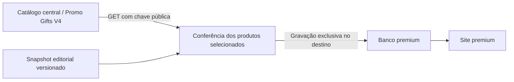

# Catálogo central: integração somente de leitura

Em 22/09/2026, o usuário confirmou que `doufsxqlfjyuvxuezpln` é o banco do **Promo Gifts V4 e da gestão geral de produtos**. Este site não pode alterar dados, schema, policies, permissões, funções ou serviços dessa origem.

| Responsabilidade | Projeto | Acesso deste sistema |
| --- | --- | --- |
| Catálogo central de produtos | `doufsxqlfjyuvxuezpln` | GET de `v_products_public` com chave publishable |
| Curadoria publicada e dados próprios da vitrine | `whwloseshzraipljisqo` | Leitura pública; sincronização e persistência no servidor |



## Configuração e fronteira

- `SUPABASE_*` continua identificando exclusivamente o banco premium. Migrations e briefings nunca usam as variáveis da origem.
- `CATALOG_SOURCE_SUPABASE_URL` aponta exclusivamente para `https://doufsxqlfjyuvxuezpln.supabase.co`.
- `CATALOG_SOURCE_SUPABASE_PUBLISHABLE_KEY` recebe a chave publishable. O adaptador rejeita secret/service_role e JWT legado; não possui alternativa administrativa.
- A chave secreta fornecida para a origem **não foi gravada no `.env.local` nem usada**. O `.env.local` é ignorado pelo Git e tem permissão `0600`.
- `scripts/lib/catalog-source.mjs` aceita somente IDs. Método GET, view e projeção de seis campos são fixos. Não recebe método, caminho, SQL, RPC ou corpo. Redirecionamentos são recusados.
- O sincronizador valida os dois hosts, recusa URLs com credenciais, caminhos adicionais, portas diferentes, query ou fragmento e limita todas as gravações ao destino premium.
- A entrega de briefing recusa o projeto operacional como webhook, inclusive o host legado de Edge Functions. As gravações e o webhook recusam redirecionamentos.
- [AGENTS.md](../AGENTS.md) preserva a proibição para trabalhos futuros.

A chave publishable respeita grants e RLS existentes; **não é, por definição, uma credencial exclusivamente SELECT**. A restrição aqui é implementada no cliente do site, que só oferece GET e não possui chave administrativa da origem. Nenhuma policy ou permissão do banco operacional foi alterada ou certificada por esta entrega. Referência: [documentação oficial das chaves Supabase](https://supabase.com/docs/guides/getting-started/api-keys).

## Conferência e sincronização explícita

```bash
npm run check:catalog-source
npm run db:sync-catalog -- --dry-run
npm run db:sync-catalog
npm run check:editorial:live
```

O primeiro comando apenas consulta a origem. O segundo também confere a publicação no destino, sem gravação em nenhum banco. O terceiro repete as conferências e grava somente no banco premium. O último compara os 12 campos públicos publicados com o snapshot editorial.

A seleção existente permanece com oito produtos. IDs, SKU, nome original, mínimo e elegibilidade de personalização precisam coincidir com a origem e todos devem estar ativos. Títulos editoriais, descrições, categorias, slugs, imagens e demais decisões públicas permanecem no snapshot revisável. A validação não certifica estoque, preços, alegações dos textos nem direitos das imagens.

Resposta incompleta, IDs ausentes/duplicados, item inativo, dados inválidos, divergência ou indisponibilidade **interrompem a sincronização antes de qualquer escrita**. Uma despublicação no destino também interrompe o processo para não ser desfeita. Não se interpreta uma falha de leitura como autorização para apagar ou publicar produtos.

Não há cron nem sincronização automática. Mudanças no catálogo central não aparecem imediatamente na vitrine. Quando houver divergência, revisar a seleção e seu registro editorial, ou retirar o item de publicação **somente no banco premium**, antes da próxima sincronização. O snapshot anterior permanece no site até essa ação; interromper a sincronização não o remove automaticamente. `sourceDate` continua sendo a data do snapshot editorial e não a hora da última leitura central.

## Evidências desta implementação

- Leitura real da origem com chave publishable: HTTP 200; oito produtos ativos e coincidentes nos campos conferidos.
- Ensaio real de sincronização: oito produtos validados; destino premium confirmado; nenhuma gravação no ensaio.
- Sincronização efetiva executada depois dos testes: oito registros gravados exclusivamente em `whwloseshzraipljisqo`; a origem recebeu somente GET. A conferência posterior encontrou oito publicados com os 12 campos públicos iguais ao snapshot.
- Testes isolados cobrem separação das credenciais e hosts, método GET na origem, bloqueio de chave administrativa, divergências, falhas, respostas incompletas, despublicação e ausência de redirecionamentos.
- Resultado local: **35 testes da fronteira, 41 cenários isolados e 32 testes de API/vitrine no Chromium aprovados**. TypeScript, build de produção, verificação de segredos e orçamento de desempenho também passaram.
- A CI executa `npm run test:catalog-boundary` sem credenciais reais. A suíte de cenários valida também que o briefing rejeita o banco operacional como destino de persistência ou receptor, sem nenhuma gravação ou chamada a esse projeto.

Não foi executado teste de escrita, migration ou mudança de permissão no banco operacional.
